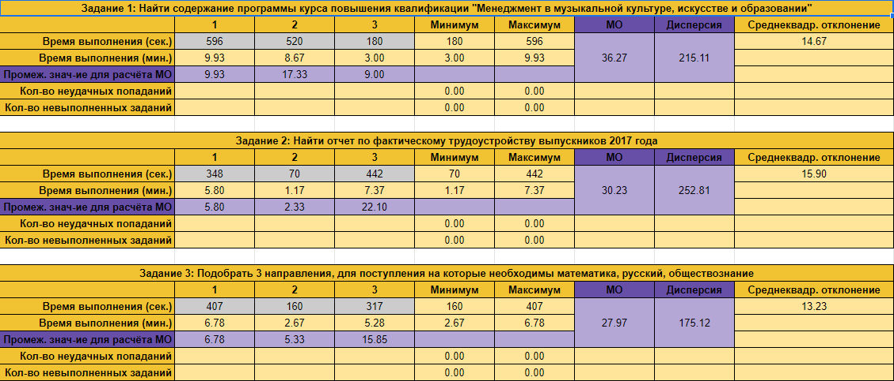
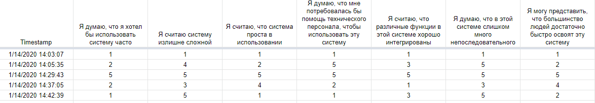
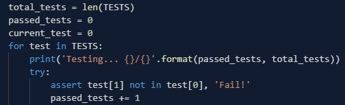
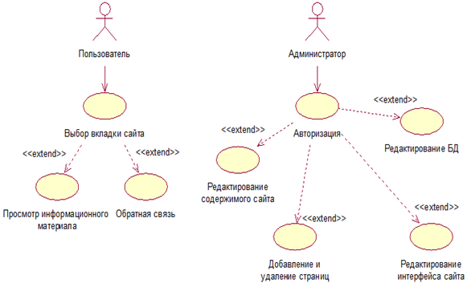

# 3-ivt-17-t3
Тема 3. 3ИВТ/17

# ИСР
## Результаты юзабилити-тестирования

## SUS

Возьмём результаты №2 (от 14:05:35).

Для каждого из нечётных вопросов необходимо вычесть 1 балл. Для каждого из чётных - вычесть значение из 5, сложить оба значения и умножить на 2.5.

(((2 + 2 + 3 + 2) - 4) + (1 + 0 + 0)) * 2.5 = ((9 - 4) + 1) * 2.5 = 6 * 2.5 = 15%

## Unit-тестирование

## Диаграмма прецедентов

# ВСР

